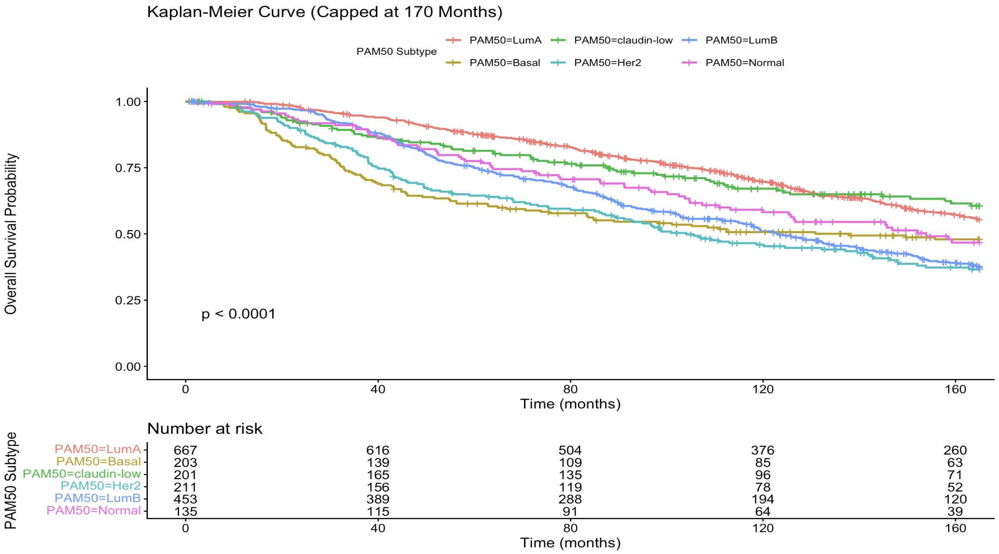
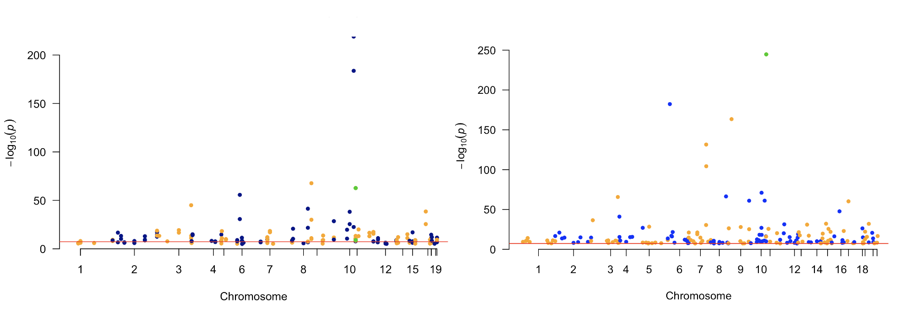

## Hello!
My name is Jessica, and I am currently a Master's student in the Health Data Science program at the University of California San Francisco. I am passionate about the intersection of data and healthcare, and driven by the opportunity to turn complex data into meaningful insights that genuinely improve patient care. With a background in healthcare data science, I am particularly interested in applying analytical methods to help streamline clinical trial operations and support decision-making in the pharmaceutical industry, where good data can make a real difference. When I'm not wrangling data, you can find me on the badminton or pickleball court!

### Projects
#### [Survival Differences Across PAM50 Subtypes in Breast Cancer](https://github.com/hojess20/ucsf-portfolio/tree/main/SurvivalAnalysis)

This analysis investigates the time-varying impact of PAM50 molecular subtypes on overall breast cancer survival. Using the METABRIC dataset of nearly 2,000 primary breast tumors, I developed a multivariable Cox proportional hazards model adjusting for age, tumor size, and histologic grade. To account for non-proportional hazards and non-linear risks, the analysis evaluated survival across three distinct time intervals (0–40, 40–80, and 80–170 months) and incorporated natural cubic splines to accurately model tumor size.

#### [Dementia Prediction](https://github.com/hojess20/hojess20.github.io/tree/main/DementiaPrediction)

This project explores predicting dementia diagnoses and identifying at-risk subgroups using clinical and neuropathological variables from the Aging, Dementia, and Traumatic Brain Injury (TBI) study. Both a logistic regression model and a random forest classifier were implemented to predict dementia status using features such as age, TBI history, Braak stage, and ApoE4 allele presence. Additionally, a k-means clustering algorithm was applied to uncover distinct natural subgroups within the population and evaluate their varying risk profiles.

#### [Genome-Wide Association Study of T2D](https://github.com/hojess20/hojess20.github.io/tree/main/GWAS-T2D)

I conducted a genome-wide association study (GWAS) analyzing genetic risk factors for Type 2 Diabetes (T2D) in East Asian populations. Using summary statistics from the Spracklen et al. (2020) meta-analysis (N = 433,540), the KCNQ1 locus on Chromosome 11 was identified as the dominant genetic contributor to T2D risk. Comparative analysis with a smaller multi-ancestry cohort demonstrated how ancestry-specific sample sizes improve fine-mapping resolution, highlighting the importance of moving beyond European-centric genomic research in precision medicine.

---
[LinkedIn](https://www.linkedin.com/in/hojessica20/) || [GitHub](https://github.com/hojess20) || [Email](mailto:jho3@ucsf.edu)
